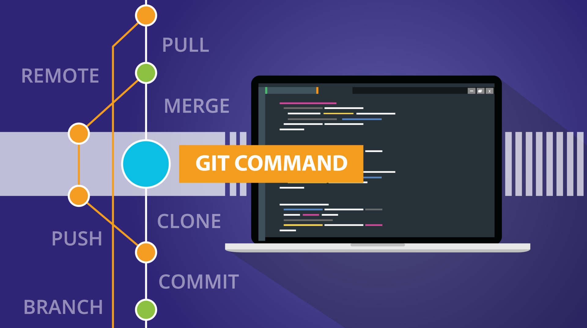

Illustration by [Muhammad Ribkhan](https://www.vecteezy.com/members/khan-zein554159)

# Git Questions

An extensive collection of meticulously curated Git questions and answers. Concepts like branching, merging, and committing to advanced topics such as rebasing, cherry-picking, and submodules, we've got you covered.

## Contribute

Pull requests are welcome.

## Table of Contents

- [Git Questions](#git-questions)
  - [Setting Up](#setting-up)
  - [Basics](#basics)
  - [Branch & Merge](#branch--merge)
  - [Workflow](#workflow) 
  - [Collaboration & Remote Repositories](#collaboration--remote-repositories)
  - [Advanced Topics](#advanced-topics)
  - [Best Practices](#best-practices)
  - [Tools & Extensions](#tools--extensions)
  - [Tips & Troubleshooting](#tips--troubleshooting)
  - [Continuous Integration & Deployment](#continuous-integration--deployment)
  - [Security & Access Control](#security--access-control)

## Setting Up

To make copy and pasting easier, set the environment variable `GIT_URL` and friends to their respective
values.

Example:

```sh
export GQ_URL=https://github.com/jcormir/git-questions.git
export GQ_BRANCH=awesome-branch
export GQ_TAG=v1.0
export GQ_COMMIT=c8e491e
export GQ_REPO=git-questions
export GQ_FILE=file.txt
export GQ_DIR=a_directory/
```

## Basics

Setup new repostories, clone existing ones, and just getting to know Git.

### Create a new repository

Create an empty Git repository or reinitialize an existing one.

```sh
git init $GQ_REPO
```

Running `git init` in an existing repository is safe. It will not overwrite things that
are already there.

### Clone existing repository

To clone an already existing repository.

```sh
git clone $GQ_URL
```

### Ignore files

The repository file `.gitignore` is a configuration file used in Git repositories to specify
files and directories that should be excluded from version control.

Example that excludes C objects (.o), Python compiled bytecode (.pyc), and directory named `build`.

```sh
*.pyc
*.o
build/
```

## Branch & Merge

Whether you're working by yourself or on a team, you should have a repository work flow
that involves merging branches. Feature branches, long term release branches, etc.

### Branch

New local branch based on HEAD.

```sh
git branch $GQ_BRANCH
```

### Switch repository branch

Switch repository branch.

```sh
git switch $GQ_BRANCH
```

### Branch from an existing branch

New local branch from existing branch.

```sh
git branch $GQ_BRANCH <base-branch>
```

### Branch from a specific commit or tag

If you want to start your new local branch based on a specific commit or tag, then
you can provide the commit hash or tag name as the starting point.

```sh
git branch $GQ_BRANCH $GQ_COMMIT
```

### Push local branch to remote repository

After working on your new local branch for some time, you might want to publish it in your
remote repository, to share it with your team:

```sh
git push -u origin $GQ_BRANCH
```

The `-u` or `--set-upstream` tells Git to establish a tracking reference, which argument-less
**git-pull** and other commands make use.

## Workflow

Commands you will use throughout the development day.

### Add file or changes to commit

To track a file or add changes that are yet apart of a commit.

```sh
git add $GQ_FILE
```

### Unstage a file or directory

If you need to remove a file from the staging area.

```sh
git reset HEAD -- $GQ_FILE
```

If you need to remove a directory from the staging area.

```sh
git reset HEAD -- $GQ_DIR
```

Your changes will be kept. When you run `git status` the file will once again show up as
modified but not yet staged.

### What revision last modified a line of a file

If you're looking for the revision and author that last modified each line of a 
file, the `git blame` command does exactly that.

```sh
git blame
```

If you would like to limit the output to a line range use the `-L` argument.

```sh
git blame -L 26,28
```

### Looking through repository history

To pick through the repository commit history use `git log`.

List commits that are reachable by following the parent from the given commit(s), but
exclude commits that are reachable from the one(s) with a prefix of `^`.

```sh
git log
```

The output is given in reverse chronological order.

```sh
commit 0113f8d73745c3cda3a32360772f6055828012d3 (HEAD -> main, origin/main, origin/HEAD)
Author: Jonathan Cormier <jonathan@cormier.co>
Date:   Sun Sep 3 22:05:35 2023 -0300
```

If you want basic one line commit descriptions you can use `--oneline` argument.

To narrow the output a special notation `<commit1>..<commit2>` can be used as a short-hand
for `^<commit1> <commit2>`. For example, either of the following may be used interchangeably:

```sh
git log origin..HEAD
git log HEAD ^origin
```

`HEAD` is a reference to the latest commit in the repository.

### Commit changes

Once you have your changes staged for commit using `git add`. You need to commit.

```sh
git commit -m "Message"
```

You can make multiple commits before you push them to a remote, if the situation
calls for it. If you have too many commits you can squash them to keep the repository
history clean.

### Show the working status

To see what changes are staged for commit, untracked files, etc. Git `status` is where you
will find that information.

```sh
git status -s
```

 Use the `-s` argument for short output with just change type (M, ??) and filename.

## Collaboration & Remote Repositories

### Pull changes

Pull changes and merge remote repository or local branch.

```sh
git pull
```

### Fetch changes

Fetch changes from remote repository but don't merge.

```sh
git fetch
```

### Update a remote repository

To have your changes available through remotes, push them.

```sh
git push
```

### List remote repositories

To list the set of repositories and their location.

```sh
git remote -v
```

## Advanced Topics

Rebasing, cherry-picking, and managing submodules.

### Clone repository recursively

Clone a repository and submodules. *2.13+*

```sh
git clone --recurse-submodules $GQ_URL
```

## Best Practices

- Commit messages should being with a short description of 50 character limit on the first line. Followed
by a single blank line with each following line a description of the changes in the commit.
- Always pull before a push to make sure you will not face any rejections from Git.
- Always pull from related branches before you start new work on your code. It will keep your
branch up-to-date and reduce the chances of conflicts.

## Tools & Extensions

- [Meld](https://meldmerge.org)

## Tips & Troubleshooting

### Change Conflict Style

Change conflict style to zealous diff3, `zdiff3`.

```ini
merge.conflictStyle = zdiff3
```

## Continuous Integration & Deployment

Shallow clones aren't recommended for developers.

### Shallow clone

Perform a shallow clone when the repository history isn't a requirement and the clone with be
discarded.

```sh
git clone --depth=1 $GQ_URL
```

### Shallow clone a specific branch

Perform the same shallow only on a specific branch.

```sh
git clone --depth=1 --single-branch --branch=$GQ_BRANCH $GQ_URL
```

## Security & Access Control
